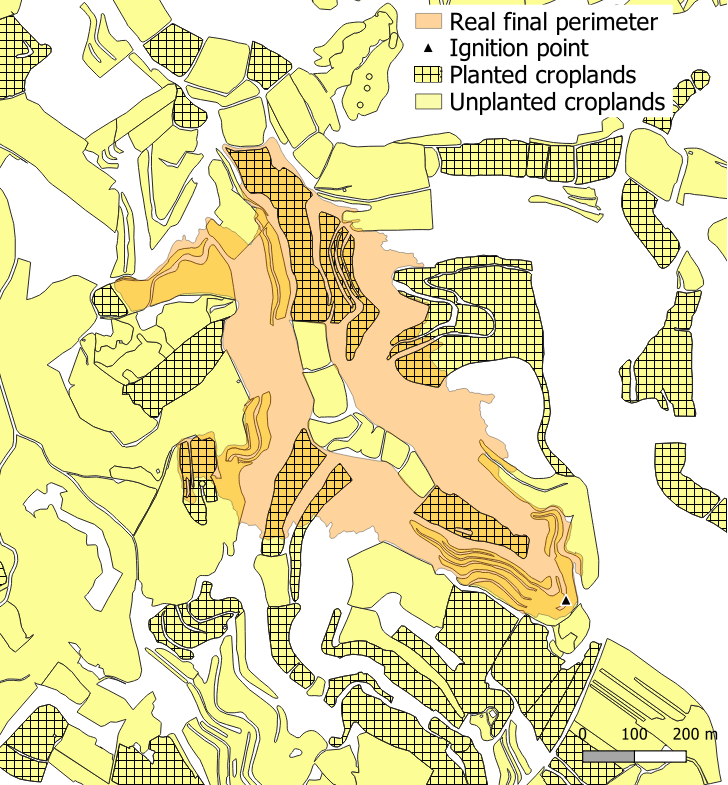

**Copyright © P. Sánchez, 2025**  
This software is released under the **GPL license** included with the package.

If you use this algorithm in your research, please cite it as:

> Sánchez, P., González, I., Carrillo, C., Cortés, A., Suppi, R. (2025). Remote Sensing AI for Crop Planting in Wildfire Fuel Mapping. In: Lees, M.H., et al. Computational Science – ICCS 2025. ICCS 2025. Lecture Notes in Computer Science, vol 15906. Springer, Cham. https://doi.org/10.1007/978-3-031-97635-3_8

This code was developed as part of the **SALUS (CPP2021-008762)** framework.

---

# NDVI-based Cropland Status Update for Wildfire Fuel Mapping

Accurate wildfire prediction requires up-to-date, high-resolution fuel maps that account for seasonal vegetation changes.  
This code updates cropland maps to indicate whether fields are **planted** or **unplanted** by combining remote sensing indices with machine learning.

Using Sentinel-2 data, the algorithm classifies croplands, achieving around **80% accuracy**.  
The AI model was trained on cropland data from 2021–2023 in Catalonia, covering soft wheat, barley, oats, and corn, focusing on fields cultivated consistently across the years.

Vegetation indices used include:  

- **NDVI**  
- **MSAVI**  
- **GNDVI**  
- **EVI**

The training data and model training are **not included**. A pre-trained model is provided, along with an example showing how to update croplands for a wildfire event in Nalec, Catalonia (Spain) in 2019.

---

## Input Data

Input data is stored in `/data/raw` and sourced from:

- **Crop yield data**: Catalonia’s DACC (Unique Agrarian Declaration, DUN). Each year, all declared crop fields are available as shapefiles.  
  Download: [Catalonia DUN](https://agricultura.gencat.cat/ca/ambits/desenvolupament-rural/sigpac/mapa-cultius/)

- **Remote sensing data**: Sentinel-2 multispectral L2A products.  
  Download: [Copernicus Data Space](https://browser.dataspace.copernicus.eu/?zoom=5&lat=50.16282&lng=20.78613&themeId=DEFAULT-THEME&visualizationUrl=U2FsdGVkX199UYFt%2B3HBhxqcEczIBYHbIilM%2FQaFo4qdgzaU1ZiWJgnTgXlRtCp0XmueIOGEJPzY99Gln2ozttryqdGrghy3oM62qleGcuRDTTaKYZ18bhZkzPMuMBQ%2B&datasetId=S2_L2A_CDAS&demSource3D=%22MAPZEN%22&cloudCoverage=30&dateMode=SINGLE)

- **Fuel map for study area**: Nalec fuel map, a subset of layer 4 from Previncat.  
  Download: [Previncat](https://previncat.ctfc.cat/)

- **Pre-trained model**: Located in `/data/model`.  
  - CatBoost model file: `.cbm`  
  - Scaler file: `scaler.pkl` (used to apply the same transformation as in training)

- Sentinel-2 bands were downloaded for **June 17, 2019**, a few days before the wildfire under optimal weather conditions (**June 24, 2019**). Croplands are from the 2019 shapefile for Nalec.

---

## Download Bands

`Download_bands.py` allows downloading Sentinel-2 L2A bands **B02, B03, B04, B08** for a specific date using the openEO API.  
The script applies **SCL masking** to remove clouds and requires specifying the desired extent in **EPSG:4326** (WGS84, lat/lon).

> Note: This script is optional and not called from `main.py`.

---

## Preprocessing

- **process_indices()**: Computes NDVI, EVI, MSAVI, and GNDVI from the downloaded bands and applies SCL masking.  
- **generate_cropland_mask()**: Generates a TIFF mask of croplands from raster and shapefile data, aligning with Sentinel-2 grid.  
- **add_ids_to_croplands()**: Assigns a unique ID to each cropland for differentiation.  
- **create_df_crops()**: Creates a dataframe containing median values of NDVI, EVI, MSAVI, and GNDVI for each cropland. These values are used for prediction.

---

## Model Prediction

- **predict_with_catboost()**: Predicts cropland status (**planted = 1**, **unplanted = 0**) using the pre-trained CatBoost model.

---

## Fuel Map Update

Updates each cropland in the fuel map according to predicted status:

- **Unplanted fields**: Assigned the **Burgan NB3** fuel model (acts as fire barriers)  
- **Planted fields**: Assigned the **GR4** fuel model (represents 2-foot-deep vegetation in arid/semi-arid climates)

> Existing fuel data is overwritten with the new classification.

---

## Output

The output is a **GeoTIFF fuel map** with updated cropland statuses.
The following map shows the wildfire and the croplands, with AI predictions indicating which fields are planted and which are unplanted.

